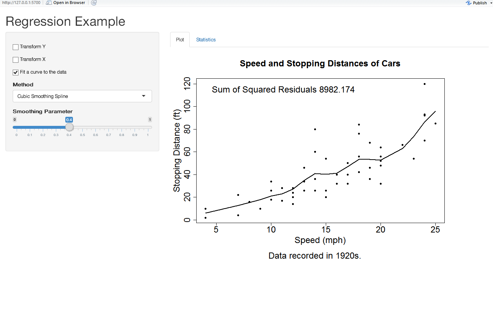

Regression Example
========================================================
author: Xiaoyu Zhang
date: June 20
transition:rotate

App
============================

Shiny Application
- URL:[https://github.com/simon-zhang36/datasciencecoursera/tree/master/Developing%20Data%20Products/project](https://github.com/simon-zhang36/datasciencecoursera/tree/master/Developing%20Data%20Products/project)
- A shiny-App shows a simple regression model between car speed and car stopping distance


Cars dataset - Description
========================================================

The data give the speed of cars and the distances taken to stop. Note that the data were recorded in the 1920s.

- speed	 numeric	 Speed (mph)
- dist	 numeric	 Stopping distance (ft)

Source: Ezekiel, M. (1930) Methods of Correlation Analysis. Wiley.
References: McNeil, D. R. (1977) Interactive Data Analysis. Wiley.

Cars dataset - Summary
========================================================


```r
summary(cars)
```

```
     speed           dist       
 Min.   : 4.0   Min.   :  2.00  
 1st Qu.:12.0   1st Qu.: 26.00  
 Median :15.0   Median : 36.00  
 Mean   :15.4   Mean   : 42.98  
 3rd Qu.:19.0   3rd Qu.: 56.00  
 Max.   :25.0   Max.   :120.00  
```

App interface
========================================================



